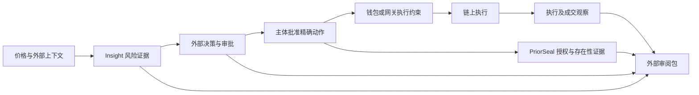

# Insight 与 PriorSeal：相似项目、技术路线与商业机会研究

> 后续落地：报告中的 npm 0.2.1 与技术缺口属于研究时点观察。前三项优先改进已实现，独立验证器 0.3.0 已公开发布；详情见 [实现与验收](../implementation/priority-hardening-2026-09-27.md)。

研究日期：2026-09-27（Asia/Shanghai，UTC+8）

研究对象：[Insight](https://www.oracleinsight.xyz/) 与 [PriorSeal](https://priorseal.xyz/)

本报告包含：67 个项目／产品／技术家族与研究原型、17 组重点技术比较、36 份行业材料与论文，以及分产品的机会和执行建议。

## 1. 先看结论

**两个项目所在的市场已有直接竞品。机会在具体工作流的可信交付、独立复核和实际集成，通用签名、日志或“AI 安全”标签本身不足以构成护城河。**

1. **Insight 可以独立销售。** 最适合首先验证的客户是借贷自动化开发者、金库管理者、交易机器人和钱包集成方。核心价值是跨来源风险判断、数据有效期、解释和可复核证据。Chaos Labs、Gauntlet、Hypernative、Forta、Blockaid 已占据风险管理或交易安全的重要位置；应选择具体资产、链和动作证明增量价值。
2. **PriorSeal 可以独立销售。** Agent Passport System、AuthProof、AgentMint／AERF、Acta 等已在授权与收据方向开展工作。更可辨认的定位是：把有边界的用户授权、执行前存在性和实际 EVM 执行关联起来，允许外部审阅者独立验证。
3. **组合产品适合资金动作。** 金库换币、再平衡、有限范围借贷操作及后续 RWA 场景，可形成“风险依据 → 决策 → 用户授权 → 执行 → 结果核验”的工作流。需要同时证明风险、权限和执行结果的买方才适合买两者。
4. **钱包和策略系统是关键合作层。** Safe、Zodiac、MetaMask Delegation、Turnkey、Privy 已具备不同形式的执行约束。PriorSeal 的证据侧车应接入它们的真实执行路径；收据本身不阻止旁路交易。
5. **代理支付是值得验证的新市场。** AP2、Verifiable Intent、Visa TAP、x402 已形成不同层次的支付和授权协议。机会是明确的适配器、结算关联和争议证据，需求与付费意愿仍需验证。
6. **RWA 有潜力，但现阶段要限制承诺。** 市场日历、资产身份、交易资格、价格有效性和执行结果可以逐步核验；发行人履约、储备、赎回权和法律效力需要其他可信来源。
7. **短期优先解决交付可信度。** Insight 的公开 verifier 版本与工作区新收据版本的衔接、覆盖与数据新鲜度说明、独立来源的分类，以及真实集成案例，优先级高于扩展更多泛用功能。

以上机会排序属于本研究的判断，不能由行业增长报告直接推出客户会购买这两个产品。具体项目与来源见第 4—6 节。

## 2. 研究范围与证据等级

### 2.1 做了什么

- 从本地两个仓库的产品说明、SDK、证据语义、覆盖策略和部分实际实现出发，确定比较维度。
- 检索公开 GitHub、官方产品文档、协议规范、研究机构报告和学术论文；对最接近的项目进一步读取部分源文件。
- 将直接竞品、执行层合作方、上游数据、协议标准和可替代技术分别列出；67 个条目不是 67 个直接竞品。
- 对商业报告阅读公开正文或摘要；对选定论文阅读正文关键章节，其余依据摘要。每份材料标出阅读范围。

**范围限制：** 公开检索无法保证穷尽所有相似项目、私有产品和付费研究。本报告没有做完整安全审计、独立生产负载测试、全链覆盖测试或客户收入核验。搜索抓取日期也不等于报告数据截止日期。

### 2.2 如何理解本文的结论

| 标记 | 含义 | 能支持的结论 |
|---|---|---|
| A | 读取了指定源码／配置 | 指定文件中的实现事实；不代表全系统无旁路或安全 |
| B | 官方文档、规范、项目 README | 项目公开描述的设计和功能；生产表现仍需验证 |
| C | 商业页面、论文摘要、自述指标 | 提出比较和验证假设；不能直接当作独立验证结果 |
| 判断 | 本报告的产品或市场推断 | 需要客户访谈、试点和数据检验 |

“未核实”表示此次材料未建立该能力，不表示产品绝对没有该能力。早期仓库、规范草案和成熟商业服务不能仅凭功能名称视为同等替代品。

### 2.3 本地基线

| 项目 | 本次读取时 HEAD | 主要本地事实来源 |
|---|---|---|
| PriorSeal | `cf1becc295b1cfcfc978abedc9437f9f77bf3afd` | [README](/Users/imokokok/Documents/PriorSeal/README.md)、[首版范围](/Users/imokokok/Documents/PriorSeal/docs/product/first-release-scope.md)、[证据关系层级](/Users/imokokok/Documents/PriorSeal/docs/architecture/evidence-relationship-levels.md)、SDK 与授权／执行观察源文件 |
| Insight | `bfdada7e0a0c34ba03038e9d75b8708929ffc87f` | [README](/Users/imokokok/Documents/insight/README.md)、[覆盖设计](/Users/imokokok/Documents/insight/docs/coverage-slo-design.md)、[RWA v2](/Users/imokokok/Documents/insight/docs/rwa-v2.md)、来源分组与覆盖 SDK 实现 |

HEAD 标识代码基线；本地文档和工作区内容也参与研究，不能把 HEAD 当作所有已读工作区内容的哈希。

## 3. 两个项目的技术位置

### 3.1 Insight：风险信息与决策依据

公开设计包括多预言机聚合、偏差／新鲜度／一致性判断、稳定币脱锚、借贷安全缓冲，以及 API、MCP 和 SDK。README 列出 Chainlink、API3、RedStone、DIA、WINkLink、Supra、TWAP、Reflector、Flare、Band；“10 个来源、40+ 链”不代表每个资产在每条链都具有同等可用覆盖。

规则驱动的交易前判断输出 PASS／CAUTION／DANGER／BLOCK。ML 增强处于实验定位，并非核心裁决来源。EIP-712 签名绑定风险判断及其相关参数；新版本还强化阈值、来源观测和语义版本绑定。独立 verifier 依赖调用方认可的注册表与语义配置，未知版本应拒绝或明确失败。

`assessSwap()` 与外部决策、执行分离；后续执行核验需要核对实际结果。便捷执行入口中的门控，不意味着所有外部钱包交易都受 Insight 控制。[本地 README](/Users/imokokok/Documents/insight/README.md)

**关键边界：** 跨来源一致不保证上游独立或价格正确；签名不保证数据真实；执行前快照不能保证随后市场状态不变；符合风险阈值不保证盈利。

### 3.2 PriorSeal：授权与执行关联证据

主流程是有主体、受众、时限及单次使用边界的授权，经接受和执行前存在性证明后，与 EVM 执行观察关联，再生成可验证收据。授权可使用 EIP-712 EOA／ERC-1271；收据使用 Ed25519。存在性证据可采用 RFC 3161 TSA、见证者或 EVM 锚定，不同方式具有不同信任与验证条件。

`priorseal.intent.v2` 精确绑定链、执行者、nonce、目标、calldata 哈希和原生币金额，可附外部上下文摘要。系统分别报告证据有效性、执行状态和授权合规性；待确认、缺失或重组情况下，不能贸然判定执行合规。

核心是非托管证据侧车，不持有钱包私钥、不代替钱包构造签名和广播。收据内的密钥不能自行建立信任；ERC-1271 历史状态、链上锚定和执行观察可能仍需外部链数据。[首版范围](/Users/imokokok/Documents/PriorSeal/docs/product/first-release-scope.md)、[威胁模型](/Users/imokokok/Documents/PriorSeal/docs/security/threat-model.md)

**关键边界：** calldata 匹配不等于经济结果良好；RPC 观察不自动变成无信任链证明；摘要绑定不自动证明运行时真正采用了该风险判断。[证据关系层级](/Users/imokokok/Documents/PriorSeal/docs/architecture/evidence-relationship-levels.md)

### 3.3 三种可分别出售的能力

| 产品 | 买方想解决的问题 | 最小可信交付 |
|---|---|---|
| Insight 单独 | 这次资金操作的数据和风险是否满足我的条件？ | 明确覆盖、有效期、判断依据、风险规则版本和可验证结果 |
| PriorSeal 单独 | 谁授权了什么，授权是否先于执行，实际执行是否匹配？ | 主体授权、可信时间／存在性、执行关联、外部可用 verifier |
| Insight + PriorSeal | 操作基于什么判断，被谁批准，最后实际发生了什么？ | 两种原生证据交叉绑定，真实执行路径集成，结果与不确定状态分开 |

## 4. 项目版图：67 个相关条目

关系说明：**竞**＝业务或技术重叠；**合**＝潜在集成方；**源**＝上游数据；**标**＝协议／规范；**基**＝底层技术。I＝Insight，P＝PriorSeal。关系可以并存。

### 4.1 DeFi 风险、交易安全与预言机

| 编号 | 项目／主要来源 | 技术与能力 | 关系／关联产品 |
|---|---|---|---|
| 01 | [Chaos Labs / Chaos Agents](https://github.com/ChaosLabsInc/chaos-agents) | 风险参数源、链上更新代理、范围校验、延迟和熔断 | 竞／合，I；该仓库已归档，不等于服务停止 |
| 02 | [Gauntlet / Aera](https://docs.aera.finance/the-protocol/security) | 风险仿真、参数优化、金库策略与受限执行 | 竞／合，I 与组合 |
| 03 | [Hypernative](https://www.hypernative.io/) | 交易前检测、仿真、策略、持续风险监测及响应 | 强竞／合，I 与组合 |
| 04 | [Forta Firewall](https://docs.forta.network/en/latest/forta-firewall-overview/) | 检测网络与交易筛查，集成后的执行阻断 | 竞／合，I |
| 05 | [Blockaid](https://blockaid.io/transaction-security) | 交易仿真与验证，签名前策略检查 | 竞／合，I 与组合 |
| 06 | [Tenderly](https://tenderly.co/) | 状态仿真、交易 bundle、fork、资产与状态变化预览 | 竞／合，I；结果核验基础设施 |
| 07 | [OpenZeppelin Monitor / Relayer](https://github.com/OpenZeppelin/openzeppelin-monitor) | 事件扫描、过滤、触发与执行基础设施 | 合／基，I、P |
| 08 | [Euler Price Oracle](https://github.com/euler-xyz/euler-price-oracle) | ERC-7726 报价接口、适配器、路由、bid／ask 估值 | 竞／源／合，I |
| 09 | [Pyth](https://docs.pyth.network/price-feeds/core/best-practices) | 价格、置信区间、发布时间与消费端新鲜度检查 | 源／合，I |
| 10 | [Chainlink Data Feeds / ACE](https://docs.chain.link/ace/guides/policy-manager/contracts/custom-contract-types) | 价格数据与合规策略保护的合约调用 | 源／竞／合，I 与组合 |
| 11 | [RedStone](https://github.com/redstone-finance/redstone-oracles-monorepo) | 用户交易携带签名数据包，模块化消费 | 源／合，I |
| 12 | [DIA](https://github.com/diadata-org/diadata) | 数据采集、透明数据管道和预言机交付 | 源／合，I |
| 13 | [API3](https://docs.api3.org/oev/in-depth/data-feeds/) | 第一方 Airnode、组合数据 feed、签名 API | 源／合，I |
| 14 | [Chronicle Scribe](https://github.com/chronicleprotocol/scribe/blob/main/docs/Scribe.md) | 阈值 Schnorr 签名、时间信息、乐观更新与挑战 | 源／基，I |
| 15 | [Immunefi Magnus](https://immunefi.com/about/) | 多安全服务编排与自动化安全运营，供应商自述 | 竞／渠道，I 与组合 |
| 16 | [RWA.xyz](https://rwa.xyz/) | 代币化资产分类、市场数据与 API | 源／合，I 的 RWA 方向 |

### 4.2 钱包、执行约束、代理工具与支付协议

| 编号 | 项目／主要来源 | 技术与能力 | 关系／关联产品 |
|---|---|---|---|
| 17 | [Safe](https://docs.safe.global/advanced/smart-account-overview) | 多签、模块、Guard、批量调用；路径与版本决定约束范围 | 合／部分竞，P 与组合 |
| 18 | [Zodiac Roles](https://github.com/gnosisguild/zodiac-modifier-roles) | 函数和参数限制、预算／allowance、受限角色执行 | 合／竞，P 与组合 |
| 19 | [MetaMask Delegation Framework](https://github.com/MetaMask/delegation-framework) | EIP-712 授权链、ERC-1271、caveat hook、智能账户执行 | 合／竞，P 与组合 |
| 20 | [ZeroDev](https://docs.zerodev.app/sdk/v5_3_x/advanced/session-keys) | Kernel 智能账户权限与会话授权 | 合／竞，P |
| 21 | [Biconomy SmartSessions](https://biconomy-73bb4454.mintlify.app/new/smart-sessions/policies/usage-limit-policy) | 会话策略、使用次数等动作约束 | 合／竞，P |
| 22 | [Turnkey](https://www.turnkey.com/blog/turnkey-policy-engine-guardrails-web3-transactions) | 签名基础设施、enclave 内策略、允许／拒绝规则 | 合／竞，P 与组合 |
| 23 | [Privy](https://docs.privy.io/security/wallet-infrastructure/policy-and-controls) | 请求授权签名、法定人数、钱包策略和 enclave | 合／竞，P 与组合 |
| 24 | [Lit Agent Wallet](https://github.com/LIT-Protocol/agent-wallet) | PKP、分布式可编程签名、Lit Actions | 合／竞，P |
| 25 | [Coinbase AgentKit](https://github.com/coinbase/agentkit) | 代理工具与钱包提供者集成 | 合／渠道，I、P、组合 |
| 26 | [GOAT SDK](https://github.com/goat-sdk/goat) | 插件式链上工具、钱包及代理框架适配 | 合／渠道，I、P、组合 |
| 27 | [Web3 Agent Kit](https://github.com/ulsreall/web3-agent-kit) | Python 链上工具、钱包和交易操作 | 合／渠道，I、P；不由示例推断商用 |
| 28 | [x402](https://github.com/coinbase/x402) | HTTP 402 资源支付、付款验证与结算流程 | 标／合，P；必要时接 I |
| 29 | [Google AP2](https://github.com/google-agentic-commerce/AP2) | 可验证凭证形式的意图、购物与支付授权 | 标／部分竞，P |
| 30 | [Verifiable Intent](https://github.com/agent-intent/verifiable-intent) | 分层 SD-JWT、用户与代理密钥绑定、选择性披露 | 标／竞／合，P；README 为草案 v0.1 |
| 31 | [Visa Trusted Agent Protocol](https://github.com/visa/trusted-agent-protocol) | HTTP Message Signatures、商户／动作绑定和防重放 | 标／合，P |
| 32 | [Universal Commerce Protocol](https://github.com/Universal-Commerce-Protocol/ucp) | 商务流程与能力互操作 | 标／合，P 的商务适配 |
| 33 | [ERC-8004](https://github.com/erc-8004/erc-8004-contracts/blob/master/ERC8004SPEC.md) | 代理身份、声誉和验证注册表 | 标／合，I、P；身份不等于授权 |

### 4.3 授权、收据与代理治理的直接邻近项目

| 编号 | 项目／主要来源 | 技术与能力 | 关系／关联产品 |
|---|---|---|---|
| 34 | [Agent Passport System，APS](https://github.com/aeoess/agent-passport-system) | Ed25519 身份、委托、边界检查、策略与动作收据 | 强竞／合，P |
| 35 | [AuthProof](https://github.com/Commonguy25/authproof-sdk) | WebAuthn／P-256 委托、范围与撤销、执行前检查 | 强竞／合，P |
| 36 | [AgentMint Python / AERF](https://github.com/aerf-spec/aerf) | Ed25519／JCS 收据、离线 verifier、PDP 与日志证据字段 | 强竞／合，P；草案与实现版本需分别看 |
| 37 | [AgentMint Rust](https://github.com/aniketh-maddipati/agentmint) | 签名授权、单次 JTI、期限、代理检查和 SQLite 状态 | 竞／合，P；与第 36 项分开研究 |
| 38 | [ScopeBlind / VeritasActa Acta](https://github.com/ScopeBlind/scopeblind-gateway) | Cedar／WASM 门控、MCP 网关、签名和哈希链收据 | 强竞／合，P |
| 39 | [BoundaryAttest](https://github.com/cullenmeyers/BoundaryAttest) | 工具边界输入、输出、错误与签名证据 | 竞／合，P |
| 40 | [ThoughtProof Sentinel](https://github.com/ThoughtProof/thoughtproof-mcp) | 多方推理评估、ALLOW／BLOCK／UNCERTAIN、MCP 签名结果 | 部分竞／合，I 与组合 |
| 41 | [HeadlessOracle](https://github.com/LembaGang/headless-oracle-v5) | 签名市场开闭／交易状态等外部上下文 | 源／合，I、P 的 RWA 场景 |
| 42 | [AxonFlow](https://github.com/getaxonflow/axonflow) | 代理网关、工作流审批、策略和审计；BSL 1.1 | 竞／合，P 与组合；不称无条件开源 |
| 43 | [Agent Control](https://github.com/agentcontrol/agent-control) | SDK 输入／输出与工具规则、框架插件 | 竞／合，P 的执行接入 |
| 44 | [OWASP Agent Control Standard](https://github.com/GenAI-Security-Project/agent-control-standard) | 声明式控制、hook 与策略互操作 | 标／合，I、P |
| 45 | [SovereignClaw](https://sovereignclaw.com/architecture) | 确定性内核、意图表示、规则门控、签名／Merkle 证据 | 竞／技术对照，I、P；主要为供应商自述 |

### 4.4 可复用基础技术与替代路径

| 编号 | 项目／主要来源 | 技术与能力 | 关系／关联产品 |
|---|---|---|---|
| 46 | [Open Policy Agent](https://github.com/open-policy-agent/opa) | Rego 策略决策；执行点需调用并执行结果 | 基／合，I、P |
| 47 | [Cedar](https://github.com/cedar-policy/cedar) | 结构化授权语言、schema、可分析策略 | 基／合，P |
| 48 | [Ethereum Attestation Service](https://github.com/ethereum-attestation-service/eas-contracts) | schema、resolver、链上／链下 attestation 与撤销 | 基／替代，I、P |
| 49 | [Sigstore / Rekor / in-toto](https://github.com/sigstore/rekor) | 签名来源证明、透明日志、声明封装 | 基／合，I、P |
| 50 | [SCITT / CCF ledger](https://github.com/microsoft/scitt-ccf-ledger) | COSE 声明、透明登记、CCF 收据和独立验证 | 标／基／合，P |
| 51 | [dstack / Phala](https://github.com/Dstack-TEE/dstack) | 机密计算、远程证明、密钥派生 | 基／合，I、P |
| 52 | [EigenAI](https://arxiv.org/abs/2602.00182) | 位级确定性推理、复算和验证机制 | 基／部分替代，推理证据层 |
| 53 | [RISC Zero](https://github.com/risc0/risc0) | zkVM，证明指定程序计算和公开输出 | 基／合，I、P |
| 54 | [SP1](https://github.com/succinctlabs/sp1) | zkVM，可编程计算证明 | 基／合，I、P |
| 55 | [Langfuse](https://github.com/langfuse/langfuse) | trace、评测、数据集与观测平台 | 部分替代／合，P 的审计需求 |
| 56 | [Phoenix](https://github.com/Arize-ai/phoenix) | OpenTelemetry／OpenInference 观测和评测 | 部分替代／合，I、P |
| 57 | [Guardrails AI](https://github.com/guardrails-ai/guardrails) | 结构、内容与输入输出验证器 | 部分替代／合，代理保护层 |
| 58 | [NeMo Guardrails](https://github.com/NVIDIA-NeMo/Guardrails) | 可编程对话及工具调用约束 | 部分替代／合，代理保护层 |

观测工具能解决不少团队的实际追踪问题；因此即使其主要定位不同，也会与 PriorSeal 竞争预算。需要证明独立核验和跨组织证据确实带来额外价值。

### 4.5 企业身份授权、人工审批与支付的补充替代方案

| 编号 | 项目／主要来源 | 技术与能力 | 关系／关联产品 |
|---|---|---|---|
| 59 | [Auth0 for AI Agents](https://auth0.com/features/token-vault) | OAuth Token Vault、委托 token exchange、异步人工授权 | 竞／合，P；企业既有身份层 |
| 60 | [Cerbos](https://docs.cerbos.dev/cerbos/latest/index.html) | 上下文细粒度 PDP、策略管理、PEP 集成和审计 | 竞／基／合，P |
| 61 | [LangGraph](https://docs.langchain.com/oss/python/langgraph/interrupts) | interrupt、持久检查点、人工审批及恢复 | 部分替代／合，P 的审批需求 |
| 62 | [Skyfire](https://docs.skyfire.xyz/docs/features) | 代理资源支付、钱包、供应商／金额／时间支出规则 | 竞／合，P 的代理支付方向 |
| 63 | [Nevermined](https://nevermined.ai/docs/api-reference/typescript/mcp-integration) | 支付保护的 MCP、OAuth 2.1、积分计量和结算接口 | 竞／合／渠道，I 的 API 商业化、P 的支付证据 |
| 64 | [AgentGuard，WhitzardAgent](https://github.com/WhitzardAgent/AgentGuard) | 属性授权、客户端／服务端检查与运行审计 | 竞／合，P；不混同其他同名仓库 |
| 65 | [aiAuthZ](https://github.com/Sports-Vision-Inc/aiAuthZ) | 独立主机授权网关、HMAC 身份、nonce、参数策略与哈希链 | 竞／合，P；对称 MAC 信任模型 |
| 66 | [APort / Open Agent Passport](https://arxiv.org/abs/2609.22076) | 确定性执行前授权与代理付款基准 | 竞／研究对照，P；与 APS 是不同项目 |
| 67 | [NostrAgent](https://arxiv.org/abs/2609.22944) | Nostr 签名身份、递减委托、peer attestation、Lightning L402 | 标／研究对照，P；原型与 regtest 结果 |

## 5. 17 组重点技术比较

### 5.1 Chaos Labs：风险判断进入协议执行

**技术链路：** 链外 RiskOracle 提供参数，AgentHub 查询、检查并执行更新；具体 agent 将更新注入协议。范围模块、间隔、到期、熔断和权限控制限制更新。读取了 `AgentHub.sol`，属于 A 级局部实现核查。[源码](https://github.com/ChaosLabsInc/chaos-agents/blob/main/src/contracts/AgentHub.sol)、[Aave 风险代理维护说明](https://github.com/aave-dao/bored-guides/blob/main/risk-agents-maintenance.md)

**与 Insight 的差异：** 重点是持续调整协议参数，Insight 当前更接近具体操作的风险判断和证据。两者都涉及链外信息、阈值和执行边界，不能把 Chaos 仅理解为研究咨询。

**可借鉴：** 风险规则不能只输出颜色，还应说明允许变化范围、执行频率、失效条件和紧急停止路径。**机会判断：** 向自动化开发者提供更小范围的风险依据与审阅包，可能比直接争夺大型协议的全套风险管理合同更现实。

**状态：** 检索时 `ChaosLabsInc/chaos-agents` 元数据为 archived。复用时要找维护中的实际部署／下游版本；归档事实不能推导 Chaos Labs 停止经营。

### 5.2 Gauntlet／Aera：经济风险优化与受限策略执行

Gauntlet 的公开方法将坏账、清算和借贷使用率构成优化目标，用市场数据校准的 agent-based simulation 比较参数选择。其公开文章也承认非线性模型的解释难度和持续校准需求；该方法文章是历史材料，不能代表今天全部内部实现。[官方作者方法文章](https://medium.com/gauntlet-networks/gauntlets-parameter-recommendation-methodology-8591478a0c1c)

Aera 则把金库策略与安全约束放入可执行协议。[Aera 安全设计](https://docs.aera.finance/the-protocol/security)

**可借鉴：** 给风险判断加入协议经济后果，例如流动性、抵押缓冲、清算冲击，而非仅做价格偏差打分。**机会判断：** Insight 可优先服务需要透明规则、快速接入和较小覆盖范围的开发团队。要超越这类供应商，需要实证研究、协议模型和长期运行数据，只有更多 feed 接口不足以完成替代。

### 5.3 Hypernative：最需要正面比较的商业安全平台

其公开产品覆盖交易前筛查与仿真、策略、持续风险和自动响应，包含预言机操纵、脱锚等问题；它与 Insight 的重叠明显。网站性能、覆盖和防损指标属于供应商自述，本研究未独立测试。[官方产品](https://www.hypernative.io/)

**需要比较的不是功能名称，而是同一批操作的结果：** 提前发现时间、误报、漏报、可解释性、部署延迟、客户能否导出和独立验证证据。

**机会判断：** 明确资产／链／协议覆盖，提供规则与证据可移植性，并用公开重放案例证明效果。独立 verifier 可以形成区分，但如果买方只关心阻断攻击，它可能只是附加功能。

### 5.4 Forta／Blockaid：检测结果与执行门控结合

Forta Firewall 将交易筛查接入链上执行，相关文档讨论公开与私有 mempool。Blockaid 提供交易仿真和验证，其 Cosigner 在签名前评估策略。它们已有执行前保护能力，不能将它们描述成仅有事后监控。[Forta 设计](https://docs.forta.network/en/latest/forta-firewall-overview/)、[Blockaid Cosigner](https://blockaid.io/blog/introducing-recommended-policies-for-cosigner-onchain-operational-security-powered-by-ai)

**关键技术区别：** 阻断强度来自被接入的执行点；策略判断或报告在路径外时不具有同样约束力。

**机会判断：** 将其检测结果作为外部上下文与 PriorSeal 授权关联，或者用 Insight 补充可解释的经济风险。合作价值需通过导出格式、接口权限和买方需求确认，不能从“可对接”推导已建立合作。

### 5.5 Tenderly／Euler：仿真与报价各解决一部分问题

Tenderly 的 bundle 和状态覆盖仿真能预测多步调用的状态、余额等变化，但依赖选择的状态与环境；它不能保证稍后真实执行完全一致。[仿真 bundle](https://tenderly.co/blog/changelog/preview-multi-step-flows-with-simulation-bundles/)

Euler Price Oracle 使用 ERC-7726 风格的报价接口、不可变适配器、路由和 bid／ask 估值；不同适配器检查陈旧价格、置信区间等。读取了 README，未全面审计合约。[仓库](https://github.com/euler-xyz/euler-price-oracle)

**可借鉴：** 资产单位、decimals、方向、bid／ask、置信区间和更新时间都应进入明确语义，不能将所有输出当作同一种价格。

**机会判断：** Insight 将“仿真预计怎样”“数据支持什么风险判断”“实际成交怎样”作为不同证据输出，并与 PriorSeal 的授权结果关联，避免用仿真成功替代执行核验。

### 5.6 APS：PriorSeal 最接近的开放协议邻居之一

APS 已覆盖身份、递减委托、范围／预算、撤销、执行检查和收据关系，不能只称其为身份注册表。README 区分规范核心、扩展与实验功能，且存在不可互换的委托格式，集成必须固定格式与版本。[仓库](https://github.com/aeoess/agent-passport-system)

读取的 `decisionReceipt.ts` 使用 DSSE／in-toto 风格封装、规范化 JSON 和 Ed25519，绑定策略、委托根及知识性声明等。该文件负责收据生成，单独读取它不能证明所有工具调用都通过强制执行点。[决策收据源码](https://github.com/aeoess/agent-passport-system/blob/main/src/decisionReceipt.ts)

**机会判断：** 让 APS 的代理委托／决策收据与 PriorSeal 的具体 EVM 授权／执行证据相互引用。保留各自签名原文及信任规则，不把代理自己签署的决策升级成钱包主体授权。现有合成互操作示例可以帮助测试，但不等于生产客户验证。

### 5.7 AuthProof：用户委托与执行前检查

公开 SDK 用 WebAuthn／P-256 表达委托，包含范围、撤销和执行检查。它与 PriorSeal 在“谁允许代理做什么”上直接重叠。[README](https://github.com/Commonguy25/authproof-sdk)

实际读取的 `pre-execution-verifier.js` 中，`DelegationLog` 使用进程内 Map，时间依赖本机时钟；该类自身不能提供独立 TSA 时间证明或跨进程持久状态。SDK 另有生产接入建议，不能把局部文件的限制推广成整个平台不存在持久化。[源码](https://github.com/Commonguy25/authproof-sdk/blob/main/src/pre-execution-verifier.js)

**可借鉴：** 使用明确的动作范围，避免模糊文本匹配决定高风险权限。**机会判断：** PriorSeal 的差异应落实到持久化单次消费、独立存在性证据、精确 EVM 调用绑定和外部审阅流程；“有一个 verifyBeforeExecution 函数”并不能证明整个执行系统无法绕过。

### 5.8 AgentMint／AERF：收据格式、离线验证与版本成熟度

Python 生产者与 AERF 定义 Ed25519 签名、规范化 JSON、输入输出摘要、策略及离线导出。AERF 根 README 仍有早期草案描述，Go verifier 的当前说明与实现已涉及 v0.2、issuer、parent、PDP 以及部分日志证据条件，应以具体版本分别判断。[生产者](https://github.com/aerf-spec/agentmint-python)、[Go verifier 说明](https://github.com/aerf-spec/aerf/blob/main/verifiers/go/README.md)

读取了 `verify.go`；不能将它概括成只检查签名。该 Go verifier 文档同时列出尚未实现的 RFC 3161 时间戳和多收据链验证等限制。[验证实现](https://github.com/aerf-spec/aerf/blob/main/verifiers/go/internal/aerf/verify.go)

**机会判断：** 提供精确版本兼容性、链观察和授权语义的适配。签名格式并不稀缺；验证边界、失败解释、密钥信任和长期可验证性更重要。Rust 同名项目应独立核查，不能混合其功能和成熟度。

### 5.9 Acta／ScopeBlind 与 BoundaryAttest：证据来自哪一个边界

ScopeBlind／Acta 的公开路线结合 Cedar／WASM 策略、MCP 网关、Ed25519 和哈希链，并提供离线验证。网关在调用前拒绝，与工具执行后记录收据，具有不同的执行控制强度。[网关](https://github.com/ScopeBlind/scopeblind-gateway)、[Acta](https://github.com/VeritasActa/Acta)、[verifier](https://github.com/VeritasActa/verify)

BoundaryAttest 记录工具边界的输入、输出和错误，其 README 不将自身定位为完整策略引擎。[仓库](https://github.com/cullenmeyers/BoundaryAttest)

**机会判断：** 输出证据的观察角色：调用方、执行方、接收方、链观察者分别签了什么。若执行者和收据者是同一方，应明确自述属性。跨组织接收方确认可以增强证据，但所有双方串通和缺失记录问题不会因此消失。

### 5.10 MetaMask Delegation：在执行点检查完整授权链

读取的 `DelegationManager.sol` 包含 EIP-712／ERC-1271 验证、授权链关系及 caveat 在执行前后触发的检查。限制依赖具体 caveat；没有配置限制的授权不能自动视为安全的有限授权。[实现](https://github.com/MetaMask/delegation-framework/blob/main/src/DelegationManager.sol)

其框架支持智能账户与相关账户抽象机制。仓库说明开发主线与审计发布标签应区别使用，生产集成应固定已审计版本。[仓库](https://github.com/MetaMask/delegation-framework)

**机会判断：** 让钱包内的真实约束消费风险证据有效期／摘要，再将授权链和实际执行关联到 PriorSeal。工程上还需明确账户 nonce、委托消费、批量调用和恢复路径；只在客户端先调用一个校验函数，无法达到同等执行保障。

### 5.11 Safe／Zodiac：成熟执行层也是证据出口

Safe 的 owner transaction 与 module transaction 是不同路径；普通 Guard 与 Module Guard 的覆盖取决于合约版本和配置。Zodiac Roles 可针对模块操作约束目标、函数、参数和 allowance。[Safe Guard 教程](https://docs.safe.global/advanced/smart-account-guards/smart-account-guard-tutorial)、[Module Guard](https://docs.safe.global/reference-smart-account/guards/setModuleGuard)、[Zodiac Roles](https://docs.zodiac.eco/developers/roles)

**可借鉴：** 把“这个 Guard 有检查”与“所有可执行路径都有检查”分别核验，明确模块管理、管理员修改和紧急恢复的信任。

**机会判断：** DAO／金库需要向成员、投资人和审阅者解释一次操作的审批与执行过程，适合 PriorSeal 单独切入；只有买方还缺少价格和风险判断时再加入 Insight。避免未经需求验证就重建整个钱包或自行上线新高权限模块。

### 5.12 Turnkey／Privy：签名策略的强对手与分发入口

Turnkey 的策略在其 enclave 签名架构内判定。Privy 提供授权请求签名、法定人数及钱包策略；其文档区分执行位置，部分依赖仿真的限制在 API 层评估。不能笼统声称所有策略都在 enclave 内。[Turnkey](https://www.turnkey.com/blog/turnkey-policy-engine-guardrails-web3-transactions)、[Privy](https://docs.privy.io/security/wallet-infrastructure/policy-and-controls)

**机会判断：** 面向已有钱包基础设施的团队，导出能离开供应商平台审阅的证据：策略版本、请求主体、精确动作、风险上下文、执行结果。成交条件是买方确实需要跨组织审阅／留存，并且供应商接口允许获取足够信息；已有控制台日志可能已满足较小团队。

### 5.13 AP2／Verifiable Intent：分角色授权比单一收据更接近商务流程

AP2 使用签名凭证表达购物与付款授权。Verifiable Intent 的草案 README 使用分层 SD-JWT 和密钥绑定，区分即时与自主流程，并允许角色相关的选择性披露；它明确将一些传输、密钥配置和争议处理问题留在范围外。[AP2](https://github.com/google-agentic-commerce/AP2)、[Verifiable Intent](https://github.com/agent-intent/verifiable-intent)

**可借鉴：** 区分最初的用户意图、最终交易条款和支付指令，避免把自然语言意图当作精确最终授权。

**机会判断：** 为支付／EVM 结算建立适配器，绑定真实资源、订单、付款与交付证据，并保留各角色的信任根。关于 AP2 的安全研究还指出签名前上下文污染和状态绑定问题，不能因为用了签名就宣称端到端安全（见 R23）。

### 5.14 x402／Visa TAP／UCP：不同协议层不能混成同一个授权系统

x402 定义 HTTP 资源支付的验证与结算流程。Visa TAP 采用 HTTP Message Signatures，将代理请求与商户／动作、时间和会话绑定。UCP 更侧重商务能力与流程互操作。[x402](https://github.com/coinbase/x402)、[Visa TAP](https://github.com/visa/trusted-agent-protocol)、[UCP](https://ucp.dev/2026-01-11/specification/overview/)

**机会判断：** PriorSeal 可验证“用户预算／委托 → 某资源付款 → 某次结算 → 交付凭证”之间的关联。必须处理重复请求、重试、结算失败、退款与资源未交付。付款签名不自动证明用户同意具体资源，也不自动证明交付质量。Insight 可在稳定币或兑换风险实际存在时独立提供判断，普通 API 付款不必强行搭售两者。

### 5.15 ThoughtProof／HeadlessOracle：语义审阅与外部市场事实

ThoughtProof 的公开 MCP 工具提供多方推理评价和签名结果。其 `verify_before_action` 的拒绝结果仍需宿主尊重，概率性语义审阅不是经济安全证明。[仓库](https://github.com/ThoughtProof/thoughtproof-mcp)

HeadlessOracle 的公开项目提供签名市场开闭／交易状态，属于 RWA 交易上下文，不能替代价格、发行人储备或法律权利。[仓库](https://github.com/LembaGang/headless-oracle-v5)

**机会判断：** 将语义审阅、市场状态与 Insight 的价格／协议风险分开解释，联合绑定到授权。多个签名结果一致仍可能共享错误输入；应把观察来源、有效期和适用资产写清楚。已有合成跨项目样例用于兼容性验证，不应记作真实商业交易。

### 5.16 策略语言、透明日志、TEE／ZK：复用组件与信任边界

OPA／Cedar 可以承担策略决策，执行点仍需可靠调用和执行策略结果。Sigstore／Rekor、SCITT 可提供登记与来源证据。dstack 的远程证明、RISC Zero／SP1 的计算证明以及 EigenAI 的确定性推理验证，证明对象各不相同。[Cedar](https://github.com/cedar-policy/cedar)、[Rekor](https://github.com/sigstore/rekor)、[SCITT](https://github.com/microsoft/scitt-ccf-ledger)、[dstack](https://github.com/Dstack-TEE/dstack)、[RISC Zero](https://github.com/risc0/risc0)、[SP1](https://github.com/succinctlabs/sp1)、[EigenAI 论文](https://arxiv.org/abs/2602.00182)

**机会判断：** 复用策略和登记技术，提供封装与适配，同时保留原始签名语义。证明某程序运行、某输出被记录或推理可复算，不会自动证明数据真实、用户授权有效或动作符合经济利益。

SovereignClaw 的确定性内核与门控架构可以作为设计对照，但其测试／性质数量等来自供应商材料；未核实完整实现，不能把性质检查等同完整形式化验证。[架构](https://sovereignclaw.com/architecture)、[证明说明](https://sovereignclaw.com/proof)

### 5.17 企业 IAM、审批恢复与新的支付授权研究

Auth0 的 Token Vault 管理第三方 OAuth 凭证，并可结合 CIBA 异步授权；Cerbos 提供细粒度策略决策，Aperture 等执行点负责应用结果。这些产品可能已满足企业的授权和内部审计需求。[Auth0](https://auth0.com/blog/auth0-token-vault-secure-token-exchange-for-ai-agents/)、[Cerbos／Aperture](https://www.cerbos.dev/blog/fine-grained-authorization-for-ai-agents-with-cerbos-and-aperture-by-tailscale)

LangGraph 的审批恢复会从节点起点重跑，文档强调副作用幂等。集成资金动作时，必须将批准的精确 payload、单次消费和持久化幂等联系起来，不能因为有审批界面就假定只有一次交易。[恢复语义](https://docs.langchain.com/oss/python/langgraph/interrupts)

aiAuthZ 将身份与策略放在代理主机以外，并用 HMAC 和哈希链记录。**按对称 MAC 的性质推断：** 持有验证共享密钥的一方也可生成 MAC，不能直接把这种收据等同于可由任意外部方离线核验的公钥签名。远端验证服务也有自身信任依赖。[项目说明](https://github.com/Sports-Vision-Inc/aiAuthZ)

APort 的 9 月研究把付款请求、策略允许、实际执行等事件分开；其结果只针对特定权限约束，作者披露利益关系且没有真实资金移动。它支持研究确定性执行检查，不能推出权限范围内的付款都符合用户真实利益。[论文方法与限制](https://arxiv.org/html/2609.22076v1)

**机会判断：** PriorSeal 将已有 IAM／审批结果与具体 EVM 动作绑定并向外部审阅者提供证据；Insight 可以通过 Nevermined 等渠道测试付费风险 API。Skyfire／Nevermined 已提供支付和支出控制，应先找未被满足的独立复核需求，再决定是否增加支付功能。

### 5.18 最重要的能力分界

| 系统类型 | 主要建立什么 | 仍需另行建立什么 |
|---|---|---|
| 预言机 | 发布者认可的价格／时间／相关数据 | 上游独立、交易风险、用户权限、最终结果 |
| 风险引擎／仿真 | 给定输入、状态与规则下的判断或预计效果 | 输入真实、判断有效期、实际执行与结果 |
| 钱包策略／执行门控 | 已集成路径中的允许／拒绝条件 | 其他执行路径、可移植证据、经济安全 |
| 授权收据 | 主体对指定意图／动作的签名认可 | 是否先于执行、是否实际采用、是否执行匹配 |
| 时间戳／透明登记 | 指定摘要的存在或登记与相应顺序 | 记录内容的真实、未记录操作、完整业务过程 |
| TEE／ZK／确定性复算 | 对应软硬件或计算模型下的执行／计算声明 | 输入真伪、主体授权、政策适当、履约与收益 |
| Insight + PriorSeal | 在集成范围内连接风险、授权与执行证据 | 非集成操作、共同错误、发行人责任和外部法律事实 |

**产品验收应分别提问：** 数据可信吗？判断仍有效吗？用户确实批准了吗？执行点真的使用并约束它了吗？交易结果匹配吗？第三方能复核吗？这六个问题不能压缩成一个“verified=true”。

## 6. 36 份行业材料与论文：发现、机会和限制

下面的“机会”是从材料出发提出的研究判断。作者实验、问卷自报、商业预测与实际购买行为具有不同证据强度。除明确标出的正文关键章节外，不声称完成全文逐页审阅。

### 6.1 企业治理、安全与 RWA 的行业信号

| 编号 | 材料／时间／阅读范围 | 主要发现 | 对两个项目的机会与限制 |
|---|---|---|---|
| R01 | [Deloitte：AI agents scaling faster than guardrails](https://www.deloitte.com/us/en/insights/topics/emerging-technologies/ai-agents-scaling-faster.html)，2026-04-24；公开正文 | 3,235 名、24 国受访领导者中，21% 自报已有成熟代理治理 | P：授权边界和审计链有需求线索；企业自报不等于愿意购买独立收据 |
| R02 | [McKinsey：State of AI 2025](https://www.mckinsey.com/capabilities/quantumblack/our-insights/the-state-of-ai-2025)，2025；公开正文 | 代理实验与规模化价值之间存在落差，工作流改造很关键 | 三种产品都应以具体业务效果验收；采用意向不能当成已实现收入 |
| R03 | [Gartner 代理项目取消预测](https://www.gartner.com/en/newsroom/press-releases/2025-06-25-gartner-predicts-over-40-percent-of-agentic-ai-projects-will-be-canceled-by-end-of-2027)，2025-06-25；公开新闻稿 | 预测到 2027 年底超过 40% 项目会取消，涉及成本、价值及风险控制 | 先销售小范围可验收工作流；这是预测，不是已发生取消比例 |
| R04 | [WEF／Capgemini：AI Agents in Action](https://www.weforum.org/publications/ai-agents-in-action-foundations-for-evaluation-and-governance/)，2025-11；公开介绍 | 评估与治理需要贯穿代理生命周期 | P／组合：持续评估、责任链和事件复核；概念框架不证明签名 SDK 的采购规模 |
| R05 | [NIST AI Agent Standards Initiative](https://www.nist.gov/news-events/news/2026/02/announcing-ai-agent-standards-initiative-interoperable-and-secure)，2026-02；公告及概念材料 | 身份、授权、互操作与安全成为标准研究重点 | P：建立可适配的委托与证据接口；倡议与概念材料不是法律或已通过认证 |
| R06 | [NIST：Agentic AI needs strong identity](https://www.nist.gov/blogs/cybersecurity-insights/back-future-why-agentic-ai-needs-strong-identity-foundation)，2026-08-27；正文 | 代理应有清楚的身份、权限和责任基础 | P：映射现有 IAM 和钱包主体；无需先建设另一个通用身份网络 |
| R07 | [OWASP Top 10 for Agentic Applications 2026](https://genai.owasp.org/resource/owasp-top-10-for-agentic-applications-for-2026/)，2026 版；公开说明 | 目标劫持、工具误用、权限和级联问题等构成代理威胁 | 三种产品：制作明确威胁与失败用例；签名只能覆盖其中部分问题 |
| R08 | [AIUC-1 Q1 2026 更新](https://www.aiuc-1.com/research/quarterly-update-of-aiuc-1-q1-2026)，2026-Q1；公开正文 | 能力约束、治理与证据要求继续具体化 | P：向评估方提供可复核证据；商业标准与认证不等于监管批准，单份收据不足以认证企业 |
| R09 | [Chainalysis 2026 Crypto Crime Report introduction](https://www.chainalysis.com/blog/2026-crypto-crime-report-introduction/)，2026；公开介绍 | 盗窃、非法资金与多类安全失败仍是重要问题 | I／组合：验证与己方能力相关的事件类型；不能把全部犯罪损失当作可防御市场 |
| R10 | [Immunefi：What an onchain hack actually costs](https://immunefi.com/blog/research/what-an-onchain-hack-actually-costs-2024-2025-update/)，2026-03；公开正文 | 直接损失之外还有业务和生态后果 | I／P：降低审阅、恢复和事后调查成本；风险类型多样，不能宣称两产品能阻止所有攻击 |
| R11 | [Immunefi 关键漏洞披露研究](https://immunefi.com/blog/research/93-of-critical-crypto-vulns-are-disclosed-on-immunefi/)，2026-02；公开正文 | 平台样本显示重要的上线后漏洞披露活动 | I：用真实历史案例校准规则；平台覆盖、披露样本与 opsec 排除影响统计口径 |
| R12 | [CoinGecko RWA Report 2026](https://www.coingecko.com/research/publications/rwa-report-2026)，数据到 2026-03-31；公开正文 | 其口径的代币化 RWA 市值为 193.2 亿美元，国债占较大份额 | I／组合：市场状态、资产身份与结算核验；这是 Q1 数据、不是 9 月实时值，更不是安全产品收入规模 |
| R13 | [BIS Annual Economic Report 2026：Anchoring trust in money](https://www.bis.org/publications/aer-2026/anchoring-trust-money)，2026；公开章节 | 可编程货币与代币化仍依赖制度、结算和信任基础 | 组合：连接链上动作与业务证据；不能用交易收据取代法定权利、储备或履约证明 |
| R14 | [a16z State of Crypto 2025](https://a16zcrypto.com/posts/article/state-of-crypto-report-2025/)，2025；公开正文 | 稳定币、机构参与和 AI／crypto 交叉受到关注 | P／组合：优先验证资金与支付流程；VC 视角和交易量不能直接推导可获得预算 |

### 6.2 风险模型、执行治理与可验证代理研究

| 编号 | 材料／时间／阅读范围 | 技术发现 | 可转化机会与研究边界 |
|---|---|---|---|
| R15 | [OVer](https://arxiv.org/abs/2401.06044)，2024；正文关键章节 | 符号分析与 SMT 探索预言机偏差下的安全参数 | I：协议专属阈值和缓冲校准；合约模型与假设不等于实时检测所有操纵 |
| R16 | [SecPLF](https://arxiv.org/abs/2401.08520)，2024；摘要 | 基于借贷机制设置价格变化限制，研究阻断操纵获利 | I：协议上下文影响阈值；需要检验合法剧烈波动、流动性和模型适用性 |
| R17 | [SoK: DeFi Attacks](https://arxiv.org/abs/2208.13035)，2022；摘要 | 系统化归类 DeFi 攻击，覆盖预言机与多步攻击等 | I／组合：建立历史回放集；旧样本中的类别比例不能当作今天的发生率 |
| R18 | [AgentSpec](https://arxiv.org/abs/2503.18666)，2025；摘要 | 以触发器、谓词和执行动作组成运行时约束 DSL | P／组合：将判断与实际执行门控分开；论文基准效果不能推广到所有代理和链上系统 |
| R19 | [Cedar 论文](https://arxiv.org/abs/2403.04651)，2024；摘要及项目文档 | 可验证、结构化和可分析的授权语言 | P：复用策略语言与版本比较；策略引擎本身不建立 EVM 执行证据 |
| R20 | [AgentBound](https://arxiv.org/abs/2606.30970)，2026-06；摘要 | 委托权限、owner 签署规则、站点动作契约与重放收据 | P：多层权限映射和第三方动作契约；未独立核验完整实现与生产部署 |
| R21 | [Mandato](https://arxiv.org/abs/2608.14074)，2026-08；摘要 | MCP 代理、签名 mandate、治理检查和哈希关联日志 | P：MCP 适配与授权链；论文架构不等于所有旁路都已被封闭 |
| R22 | [Notarized Agents / Sello](https://arxiv.org/abs/2606.04193)，2026-06；正文关键章节 | 接收方签收、HPKE 隐私、owner key 绑定、见证透明日志 | P：跨组织双方证据和最小披露；缺失／压制记录、服务方串通和商业激励仍是问题 |
| R23 | [AP2 安全分析](https://arxiv.org/abs/2608.23858)，2026-08；正文关键章节 | 系统化威胁与测试，指出签名前上下文、状态绑定和责任链问题 | P／组合：把真实订单、状态和有效期绑定到最终授权；作者使用测试环境，不能称为公开生产协议的全面攻破 |
| R24 | [ERC-8004 生态实证](https://arxiv.org/abs/2606.26028)，2026-06／07；摘要 | 截至 5 月的多链样本出现大量占位端点和可疑声誉活动 | P：用真实交互证据支持声誉；登记量不等于活跃代理、用户或付费客户 |
| R25 | [EigenAI](https://arxiv.org/abs/2602.00182)，2026-02；摘要 | 位级确定性推理与复算验证，依赖对应诚实参与者及执行假设 | I／P：将计算证据与业务证据分开；可复算不证明模型建议正确 |
| R26 | [DeFi 攻击生命周期框架](https://arxiv.org/abs/2608.15518)，2026-08；摘要 | 将攻击模式、检测和防御按生命周期连接 | I／组合：建立按阶段分解的事件回放；文中实验比例不是生产防损率 |
| R27 | [Institutional DeFi 九维风险框架](https://arxiv.org/abs/2605.05145)，2026-05-06；摘要 | 增加组合风险、理解负担与时间变化，区分风险程度和评估置信度 | I：分开“高风险”与“数据不足”，加入依赖图；回溯案例不能当作前瞻预测验证 |
| R28 | [Measuring DeFi Risk](https://arxiv.org/abs/2609.07902)，2026-09-07；摘要 | 基于聚合存款和借贷建立整体脆弱性指标，使用历史协议数据 | I：把协议总体风险作为交易风险上下文；9 月发表不代表样本也是 9 月，尚需独立复现 |
| R29 | [Chaos GMX V2 Genesis Risk Framework](https://chaoslabs.xyz/resources/chaos_gmx_genesis_risk_framework_methodology.pdf)，2023-07；摘要、方法与限制章节 | 历史轨迹、agent-based simulation、资金费率／借款费率／价格冲击共同建模 | I：收益与风险阈值需联系协议经济；这是历史发布前研究，作者明确模型行为假设和黑天鹅限制 |

### 6.3 补充：企业架构与近期授权研究

| 编号 | 材料／时间／阅读范围 | 技术或市场发现 | 可转化机会与限制 |
|---|---|---|---|
| R30 | [Okta：Securing AI Agents From Development to Enterprise Scale](https://www.okta.com/sites/default/files/2026-04/securing-ai-agents-from-development-to-enterprise-scale.pdf)，2026；架构与审批流程章节 | Token Vault、FGA、CIBA 和生命周期管理可以组合 | P：接入既有身份与审批；供应商示例不是独立生产验收，OAuth scope 还需对应具体动作 |
| R31 | [aiAuthZ](https://arxiv.org/abs/2607.05518)，2026-07-06；摘要及项目 README | 身份绑定、单次 nonce、独立主机策略及审计 | P：避免从代理文本中推断用户身份；作者实验和小样本不能证明普遍零攻击成功率，HMAC 与公钥收据不同 |
| R32 | [AgentGuard，属性授权框架](https://arxiv.org/abs/2605.28071)，2026-05-27；摘要 | 客户端／服务端检查单工具与跨工具风险 | P：研究多步权限与轻量接入；该论文对应 WhitzardAgent，不混同其他 AgentGuard 项目 |
| R33 | [APort Vault](https://arxiv.org/abs/2609.22076)，2026-09-18；摘要、复现与结论章节 | 按请求、授权、执行等事件拆分付款基准；确定性门控限制未经许可接收者 | P：回放权限越界与正确付款；没有真实钱款、部分数据／基础设施未公开、作者是相关公司创始人 |
| R34 | [Authorization Architectures for Tool-Using AI Agents](https://arxiv.org/abs/2609.15906)，2026-09-14；摘要 | 梳理主体层级、委托、执行点、注入与责任链，指出运行时执行和聚合边界问题 | P／组合：明确主体和多跳授权；综述不是部署安全证明，本研究未逐页审阅其 70 页正文 |
| R35 | [Authenticated Delegation and Authorized AI Agents](https://arxiv.org/abs/2501.09674)，2025-01-16；摘要 | 在 OAuth／OIDC 上扩展代理委托与权限元数据 | P：兼容既有身份体系；自然语言到权限的转换仍需明确验证，框架提案不代表已形成标准 |
| R36 | [NostrAgent](https://arxiv.org/abs/2609.22944)，2026-09-19；摘要 | 签名身份、递减委托、离线重放和 L402 的 Python 原型 | P：密钥轮换、撤销与付款关联；Lightning regtest／原型 benchmark 不代表生产支付表现 |

### 6.4 从材料到机会，真正成立的推理

1. **治理缺口确实值得关注。** R01、R04—R08 支持研究权限、审批和审计需求；它们没有证明买方必须用密码学收据，或会购买 PriorSeal。
2. **签名前的上下文与状态很关键。** R20—R23 支持绑定用户权限、真实订单与有效期；只有摘要绑定仍不足以证明实际执行点消费了这些信息。
3. **风险程度应与证据可信度分开。** R15、R27、R28 支持更解释清楚的风险模型：低风险判断但数据过期，与充分证据下的高风险是不同状态。
4. **RWA 的窗口来自多种不一致。** R12、R13 支持研究链上全天交易与市场日历、发行人资格、价格来源、赎回与结算之间的差异。行业资产规模不能直接换算成可销售的风控市场。
5. **真实使用比登记与签名数量更重要。** R02、R03、R24 提醒：应记录实际外部复核、动作阻断、执行关联与付费留存，合成案例数量不会替代这些证据。
6. **既有授权系统是买方的现实备选。** R30、R34、R35 支持接入 IAM 和执行点；R33 支持拆分模型提出动作与实际越权执行。必须证明独立证据的增量，不能把代理收到恶意指令本身当作未经授权付款已经成功。

## 7. 潜在机会排序：买方、产品、验收与失败条件

P0＝适合立即验证；P1＝核心交付成熟后验证；P2＝研究储备。优先级是依据产品现有范围、集成难度和买方问题作出的定性判断，并非市场统计评分。

| 编号／优先级 | 机会与产品 | 潜在买方／付费负责人 | 最小交付与验收 | 关键失败条件／研究依据 |
|---|---|---|---|---|
| O1／P0 | **代理钱包／金库的操作证据，P 单独** | 钱包或代理基础设施负责人、金库运营；审阅者是使用方但未必付款 | 一种钱包路径、一种操作，输出授权、先于执行的存在性、交易关联和独立复核包；测量调查／审批重建耗时 | 买方现有日志足够、无人外部复核或接入不到真实执行点；R01、R06、R20—R23 |
| O2／P0 | **可解释的预言机风险 API，I 单独** | 借贷机器人、金库 curator、钱包风控负责人 | 选定资产／链的来源年龄、分类、风险规则、有效期；与单 feed 及简单阈值基线比较 | 鲜度／覆盖不能满足动作时间窗，或没有显著更好的解释与风险效果；R15—R17、R27—R29 |
| O3／P0 | **换币／再平衡的完整复核，组合** | 管理资金的代理团队、DAO／金库工程负责人 | 风险依据 → 明确决策 → 主体批准精确动作 → 真实执行 → 成交核验；外部审阅者可重建一次操作 | 买方只需要其中一个问题，或只有合成动作；R01、R18、R23 |
| O4／P1 | **RWA 限定交易保护，I 或组合** | RWA 交易平台、代理开发者、机构集成团队 | 资产身份、市场状态、资格上下文、价格有效期、限定路由和实际成交；按需求增加主体授权 | 缺官方资格／资产资料、合同权利不可验证、范围过宽；R12、R13 |
| O5／P1 | **代理资源付款与结算证据，P 单独** | x402 资源商、代理采购／支付平台 | 委托预算、资源／订单 ID、单次付款、结算、交付／失败／退款状态相互关联 | 付款协议已满足需求、资源交付不可观察或没有争议成本；R20—R23、R33、R36 |
| O6／P1 | **跨组织审阅与隐私证据，P 单独** | 已有明确外部审阅需求的机构、平台或合作双方 | 独立信任根、双边签收、按角色披露、保留原始签名、透明登记和长期验证 | SSO／留存／权限需求过重，或没有实际审阅流程；R04、R08、R22 |
| O7／P2 | **来源依赖与覆盖可靠性，I 单独** | 预言机消费者、审计团队、风险平台 | 可追溯分类、共享上游／包装关系、可用性历史与故障回放 | 无法取得上游关系、评分不可验证、维护成本高；R17、R27 |
| O8／P2 | **真实交互支持的代理声誉，P 或组合** | 代理市场、注册表消费者、基础设施平台 | 与有效授权、真实执行、接收方确认关联的声明，明确样本和观察角色 | 没有真实交互、缺防 Sybil／统计分母、过早承诺通用评分；R22、R24 |

### 7.1 最适合先做的三个试点

**试点 A：PriorSeal 单独。** 找已有钱包与风险系统的团队，仅解决操作授权与审计证据。固定一种调用类型，提供可成功复核及必须拒绝的样例。请其独立审阅者实际使用 verifier；如果没有外部审阅需求，应降低此方向优先级。

**试点 B：Insight 单独。** 为一个自动化操作提供实时请求路径的来源年龄、有效期和规则解释。比较当前数据源、简单偏差阈值及 Insight；同时统计正常时期的错误阻断。只有“历史事故能打红灯”而没有正常期误报数据，不足以证明改善。

**试点 C：组合。** 在受控金额和明确范围内完成换币／再平衡全过程。验收应包含过期依据、calldata 替换、金额／接收者变化、重复授权、RPC 不一致、重组及结果不匹配。具体生产调用需要按相应合作与资金授权流程执行；本报告没有执行交易。

三个试点目标分别验证三种可售产品，不以组合项目成功作为两个单产品销售的前提。

### 7.2 谁更值得接触

| 买方现状 | 推荐先谈的产品 | 沟通主题 |
|---|---|---|
| 有钱包、授权和日志，缺少经济风险依据 | Insight | 选定链和资产的风险、新鲜度与误报改善 |
| 有风控和钱包，缺跨团队／跨公司可复核证据 | PriorSeal | 一次操作的权限、顺序和执行关联，以及复核耗时 |
| 正在做资金代理，三层都不完整 | 组合＋现有钱包合作方 | 有限范围的完整资金操作，不承担全套钱包建设 |
| 只做无资金风险的文本代理 | 谨慎评估 PriorSeal | 是否真有外部授权／证据需求，避免泛化推销 |
| 大型协议已有长期风险供应商 | Insight 的补充能力或合作 | 数据覆盖、独立复核和具体增量，避免无证据全量替代 |
| RWA 平台缺价格／市场状态 | Insight 起步，按需组合 | 区分交易风险、资格信息与发行人法律事实 |

### 7.3 定价与护城河判断

本研究未获得可比企业合同和真实成交价格，不建议把公开 API 价格与整套风险服务混为一谈，也不给“行业平均价”的虚假精度。

- **Insight：** 可测试按资产／链覆盖、请求量、历史数据和明确服务等级收费。具备长期数据前，不把内部 SLO 目标出售为已实现 SLA。
- **PriorSeal：** 可测试按项目、证据留存、外部审阅、集成与支持收费。单次签名本身容易被开源 SDK 替代。
- **组合：** 可测试固定范围的集成试点，再按工作流运营收费。需要给出审批、调查或风险控制的实际改善。

更可能形成护城河的是：可信覆盖与历史、已接入的执行路径、清楚的版本与失败语义、外部独立使用的证据，以及持续付费的工作流。格式、哈希和签名算法应当可复核，不能仅靠技术名词支撑溢价。

## 8. 研究中发现的自身交付缺口

以下是本次局部代码与文档研究的发现和建议，不是完整漏洞审计。本任务仅形成报告，没有修改生产代码或发布包。

### 8.1 Insight verifier：公开安装路径与新版本需要对齐

本地 `verifier/package.json` 为 0.3.0；README 明确公开 npm 0.2.1 不含新 v5 execution profile 支持。本次独立执行 `npm view verify-insight-receipt version`，返回 0.2.1，与文档一致。[verifier README](/Users/imokokok/Documents/insight/verifier/README.md)、[npm 包](https://www.npmjs.com/package/verify-insight-receipt)

**建议：** 在推出 v5 集成前，发布匹配的 verifier，或者提供固定源码与哈希的可重现安装路径、版本矩阵及验证包。若第三方按公开安装说明无法验证新收据，独立核验的商业优势无法兑现。此发现不意味着旧版对应收据无法验证。

### 8.2 来源独立性：旧分组和严格覆盖策略不同

读取的 `sourceGroups.ts` 将未知 provider 默认归为自己的非 derived group，alias 表当前为空；该版本表中未显式列出 Band。若未经分类的新来源进入相应输入集合，组数可能增加，不能据此声称已核实其真实独立性。尚未证明存在可利用的外部输入路径。[实际实现](/Users/imokokok/Documents/insight/src/lib/attestations/sourceGroups.ts)

相比之下，覆盖 SDK 的 `strict-300s.v3` 明确拒绝未分类来源，并显式列出 Band；其固定策略要求至少 3 个合格来源、2 个已知非 derived 组、来源年龄不超过 300 秒、spread 不超过 100 bps、报告 TTL 不超过 60 秒。重复来源和未知／无效时间也被排除。[覆盖 SDK](/Users/imokokok/Documents/insight/sdk/src/coverage.ts)

**建议：** 审查新评估版本的默认分类规则，区分 operator classification 与已核实共享上游。引入新策略／语义版本并保存旧版可验证性，避免静默改写已签名历史规则。运营方不同仍可能使用相同交易所或供应商数据。

### 8.3 数据新鲜度：采集频率、实时请求和 SLA 分开

README 的周期快照为 15 分钟，声誉与日报具有其他频率；系统也存在 live consensus／请求路径。不能据此称每个查询都只有 15 分钟旧数据，也不能将周期快照营销成毫秒级防御。[README](/Users/imokokok/Documents/insight/README.md)、[覆盖服务](/Users/imokokok/Documents/insight/src/lib/coverage/service.ts)

覆盖设计的 15 分钟时隙统计和内部 99% 目标不代表已实现 SLA，时隙间短暂中断可能不可见。[SLO 设计](/Users/imokokok/Documents/insight/docs/coverage-slo-design.md)

**建议：** 对每个可售资产／链公开实际可用来源、时间来源、请求延迟、过期率、失败率和不能支持的操作时间窗。快速行情中，应缩小评估到授权／执行的窗口，并规定何时必须重新评估。

### 8.4 执行控制：证据产品不能宣称无条件阻断

PriorSeal 核心不签名或广播交易；Insight 的 SDK 检查也只覆盖接入路径。钱包管理员、其他模块、外部工具、合约升级等可能改变权限或执行路径。

**建议：** 每个集成绘制实际权限和调用路径，标明执行点、旁路、撤销、恢复与管理员。为证据分别标注主体授权、决策者声明、网关观察与链观察角色。不能因为事后收据引用了风险摘要，就宣称运行时强制消费了风险判断。

### 8.5 精确调用：还需经济语义与代码状态

完全匹配的 target／calldata／value 仍可能是经济上不合适的动作，或者产生持续授权、跨合约影响、升级后不同逻辑。

**建议：** 对先销售的有限操作，明确 token／decimals、spender、接收者、最小输出、deadline、代码版本、pool／router 和允许的批量组合；观察实际成交和余额变化。把授权匹配、执行成功、经济目标实现分别报告。

### 8.6 链与时间：把依赖暴露给独立审阅者

RFC 3161、见证者、EVM 锚定、ERC-1271 和 RPC 观察各有信任、可用性及历史状态条件，不能统一描述成“完全离线、无信任证明”。

**建议：** 导出独立信任根、密钥有效期／撤销状态、所需链高度和确认条件；说明哪些检查可以离线，哪些需要外部状态。若数据缺失、确认不足或重组，保留 NOT_ASSESSABLE 等不确定结果。

### 8.7 RWA：工作区实现与公开产品承诺的界线

当前 RWA v2 文档为未发布工作区能力，并使用合成 fixture。范围限定在指定链和路由下的单一 exactInputSingle ERC20 交易、明确资产与代码／pool pin 等；公开 HTTP／MCP 诊断不等于签名发行人或储备证明。[RWA v2 范围](/Users/imokokok/Documents/insight/docs/rwa-v2.md)

**建议：** 先交付这一有限范围，再验证正式市场状态与资格数据。不要扩展为已经支持 mint／redeem、多跳、任意金库、法定资产权利或发行人储备证明。

### 8.8 商业证明：样例、测试网和真实客户分别记账

本次阅读到的合成互操作样例与测试网交易不能建立付费客户、生产资金规模或防损效果。本研究也未核验两个项目的完整客户账目，不能反过来断言不存在客户。

**建议：** 分别统计合成测试、测试网、真实受控执行、生产调用、外部审阅、付费和续费。由实际买方确认一次操作的节省时间或风险改善，优先发布有清楚范围与局限的案例。

## 9. 技术与商业路线建议

### 9.1 推荐的集成结构

这是推荐集成结构，不代表当前每条关系都已经在生产中建立。Insight 与 PriorSeal 可单独接入；钱包／网关由已有执行系统承担。若要求证明运行时采用了某项判断，需要执行点提供对应证据和不可绕过的约束范围。

### 9.2 30／60／90 天研究与交付计划

以下是建议目标，未创建自动化、联系客户或执行发布。

| 阶段 | 产品交付 | 市场验证 | 进入下一阶段的依据 |
|---|---|---|---|
| 前 30 天 | 对齐 verifier 安装路径；公布精确能力／版本矩阵；提供授权、鲜度、重复使用、重组等失败样例；确定一个有限操作 | 以约 10 次问题访谈和 3 个不同产品方向的试点为目标，确认付费负责人和审阅者 | 买方提供真实流程、基线、时间成本与验收标准；这些数字是计划目标 |
| 31—60 天 | 优先完成一种钱包执行路径和一种代理／API 路径；建立来源有效期与长期验证说明 | 让非项目作者独立验证证据；记录正常期误报和接入成本；争取付费范围确认 | 有真实外部复核、重复使用和明确预算，能够重现失败结果 |
| 61—90 天 | 将最有效的交付标准化；补充运行与事件恢复指标，发布范围清楚的案例 | 比较三种产品的使用、付费和留存，选择投入重心；按需求决定 RWA／支付扩展 | 买方持续使用、愿意续费，价值高于集成与运营成本 |

### 9.3 应追踪的指标

| 产品 | 有意义的指标 | 容易误导的指标 |
|---|---|---|
| Insight | 资产／链有效覆盖、来源年龄、失败率、误报／漏报、判断解释、与基线的增量 | provider 名称数量、名义链数、全部签名数 |
| PriorSeal | 被外部独立复核的证据、授权与执行关联成功率、失败解释、调查耗时、长期验证成功率 | 只有自己验证的收据量、未区分合成的样例数 |
| 组合 | 完整真实工作流数、实际决策／执行绑定、结果核验、买方成本改善 | 仅把两个摘要放进同一个 JSON |
| 商业 | 有付费负责人、付费试点、持续使用、续费与可控交付成本 | 登记代理数、网页访问、行业资产总值 |

### 9.4 应调整投入的信号

- 买方只需要风险信息：保留 Insight 单独销售，不强推组合。
- 买方只有内部排错需求，现有 trace 足够：PriorSeal 外部证据方向暂不适合该买方。
- 用户要求强制执行：优先接入钱包／网关的成熟执行层，并核查全部授权路径。
- 无法稳定满足数据时间窗：缩小动作范围；暂不承诺依赖该时间窗的生产保护。
- RWA 资格／发行人数据无法获取：继续限定技术范围，不宣传完整合规或资产权利验证。
- 试点没有实际使用与预算：调整买方和问题假设，避免用更多功能替代需求验证。

## 10. 暂时不建议优先投入的方向

1. **通用代理身份／声誉网络。** ERC-8004 与身份生态已经拥挤，真实交互和防 Sybil 数据成本高。
2. **全套钱包、托管、全链交易安全。** 已有成熟供应商，权限和责任范围扩大很快。
3. **仅销售“签名日志 SDK”。** 多个开放项目能覆盖基础需求，差异和付费理由不足。
4. **泛用的全部 AI 行为正确性证明。** TEE、ZK 和确定性复算有各自证明对象，不能靠收据承担如此宽的命题。
5. **未经验证的全面 RWA 合规。** 市场数据、执行技术和法律／发行人事实需要分别取得依据。

OpenZeppelin Defender 的托管退出日期是 2026-07-01，已经过去；其迁移指南可作为自托管运维和集成需求的观察入口，但剩余需求大小需另外验证，不能把旧服务当作当前仍正常提供的竞争产品。[官方迁移说明](https://docs.openzeppelin.com/defender/migration)

## 11. 下一步最值得跟踪的名单

| 目的 | 优先对象 | 跟踪事项 |
|---|---|---|
| Insight 直接比较 | Hypernative、Chaos Labs、Gauntlet、Forta、Blockaid、Euler | 同一场景的风险效果、覆盖、延迟、误报、执行集成和证据可移植性 |
| PriorSeal 直接比较 | APS、AuthProof、AgentMint／AERF、Acta／ScopeBlind | 主体授权、时间／日志信任、强制路径、版本兼容、执行观察和外部 verifier |
| 优先钱包接入 | Safe／Zodiac、MetaMask Delegation、Turnkey、Privy | 审计标签、权限边界、批量操作、旁路与信息导出 |
| 代理分发 | Coinbase AgentKit、GOAT、Web3 Agent Kit | 最小适配器、用户实际流程和接入维护成本 |
| 支付研究 | x402、AP2、Verifiable Intent、Visa TAP | 规范版本、角色授权、订单／付款／结算／交付关联 |
| RWA 上下文 | HeadlessOracle、RWA.xyz、现有价格供应商 | 资产身份、市场时间、数据口径、正式资格资料 |
| 证据互操作 | SCITT、in-toto／Rekor、EAS、Cedar | 保留原生签名、独立信任根、策略版本和最小披露 |
| 企业与资源支付 | Auth0、Cerbos、LangGraph、Skyfire、Nevermined | 既有权限是否足够、审批重试、预算控制、独立复核的增量 |

## 12. 可复核性记录

外部部分源码／README 的读取记录见 [source-review-2026-09-27.json](/Users/imokokok/Documents/PriorSeal/docs/research/source-review-2026-09-27.json)。其中 GitHub `blob_sha` 是指定文件内容对象的标识，**不是仓库 commit SHA**；分支链接会变化。记录只用于核对本次局部读取范围，不是审计证书。

本文在每个项目、材料与结论附近提供来源。后续比较应固定具体版本、观察日期和实际部署配置，不将商业页面、自述 benchmark 或预印本结果升级成独立生产验证。

**最终建议：先并行验证三种可售能力的需求，以有限资金工作流建立可复核交付。Insight 的重点是数据和风险质量；PriorSeal 的重点是权限、顺序和执行关联；组合的重点是第三方能重建一笔操作的完整证据。**
